# User Flows

Typical end-to-end flows through the Labor Schedule app. Diagrams use Mermaid.

## Roles

`SuperAdmin` → `CompanyAdmin` → `HotelAdmin` → `DeptAdmin`. Scope narrows down the chain (tenants → hotels → departments). Enforced in `lib/auth/rbac.ts` and per-route checks.

---

## 1. Authentication

Public routes: `/login`, `/change-password`, `/api/health`. Everything else gated by `middleware.ts` (verifies JWT in `auth-token` cookie, rotates on each request, issues `csrf_token` on GETs).

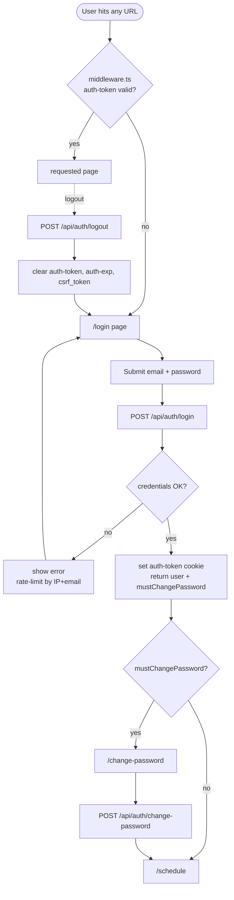

---

## 2. Navigation Map

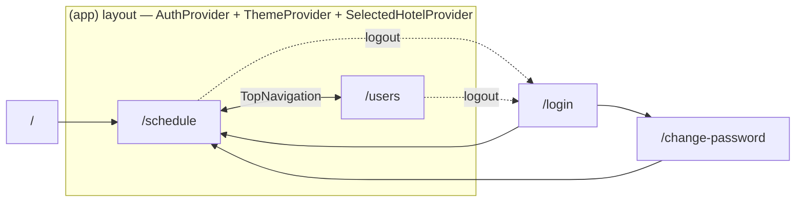

---

## 3. Schedule Editor — Main Flow

Page: `app/(app)/schedule/page.tsx`. State hook: `useScheduleState()`. Grid: `ScheduleGrid.tsx`. Buttons: `ActionBar.tsx`.

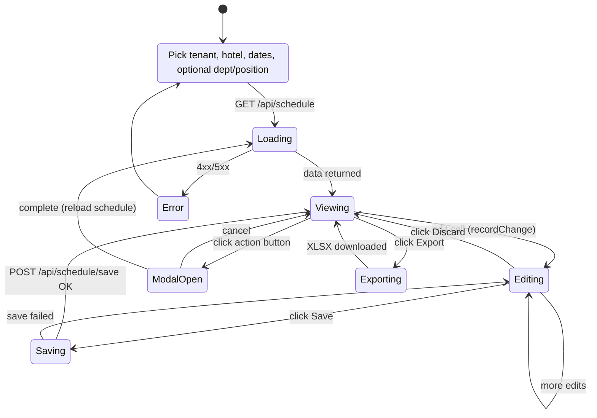

### Load + Save sequence

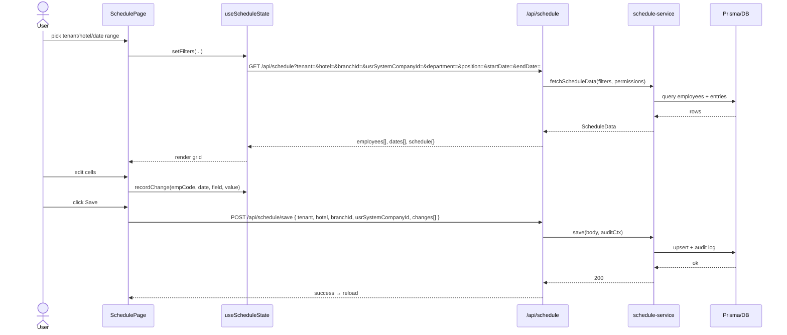

---

## 4. ActionBar Modals

Each `ActionBar` button opens a wizard or form modal. On success the schedule reloads.

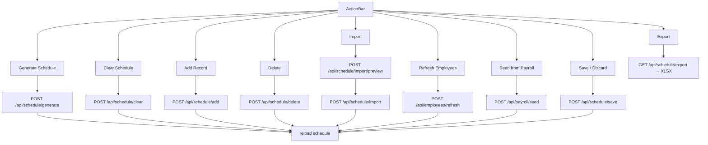

### Import wizard

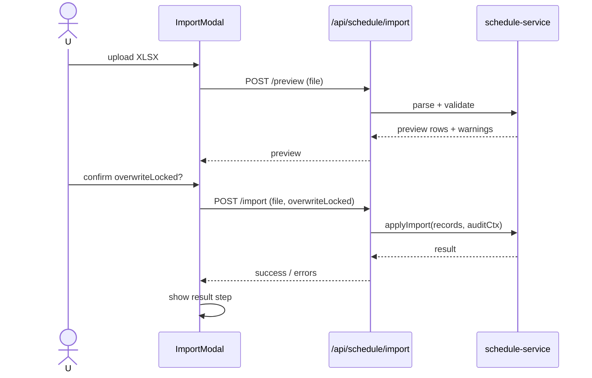

### Generate wizard

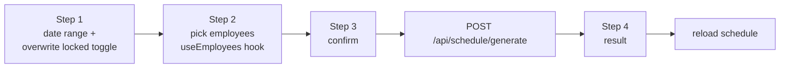

---

## 5. Export

Hook: `lib/hooks/useScheduleExport.ts`. Writer: `lib/excel/writer.ts`.

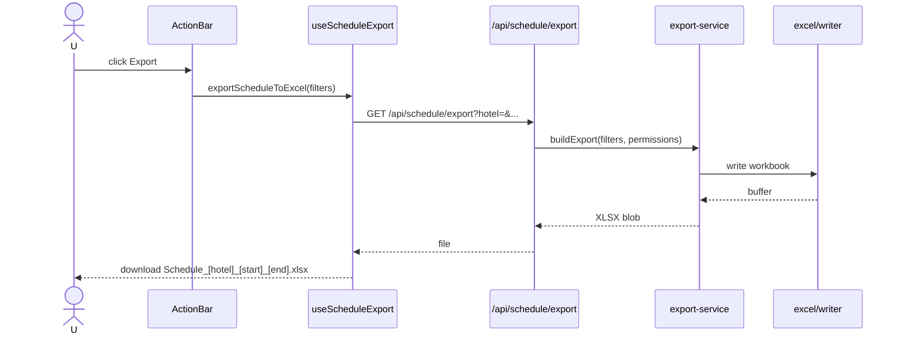

---

## 6. User Management

Page: `app/(app)/users/page.tsx`. SuperAdmin sees all; lower roles scoped.

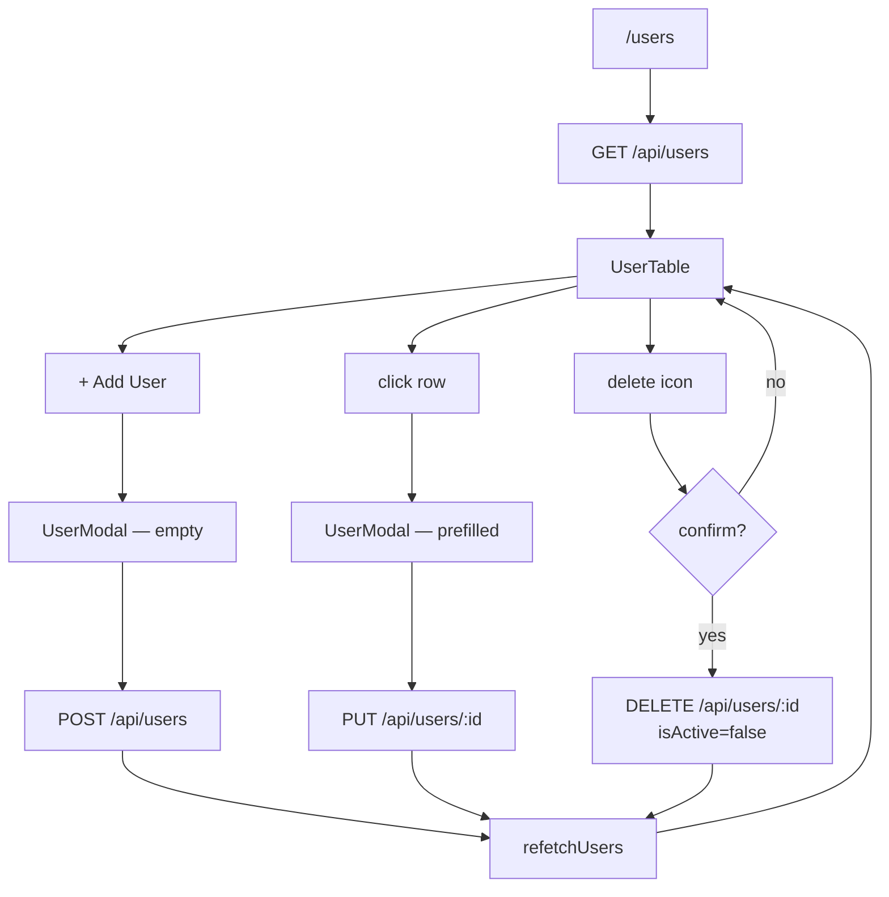

### Role-scoped create

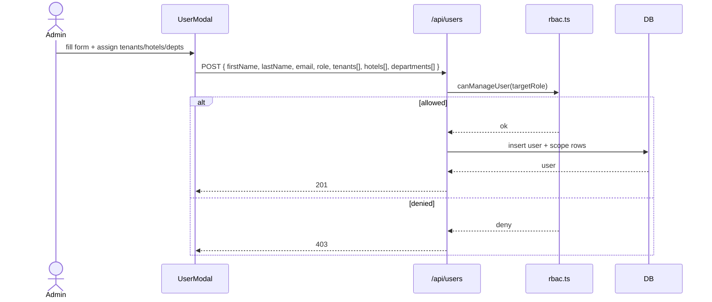

---

## 7. Permission Enforcement

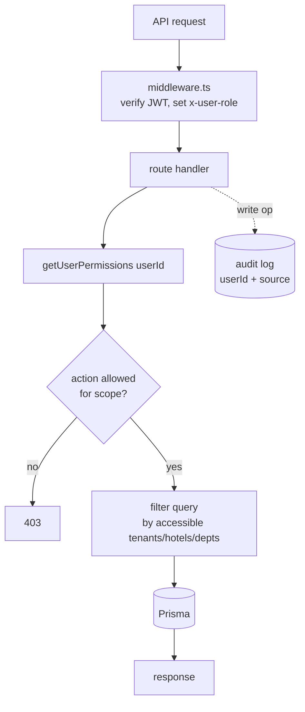

`PermissionChecker` methods:
- `isSuperAdmin()`
- `getAccessibleTenants() / Hotels() / Depts()` → `{unlimited, allowed[]}`
- `hasScheduleAccess(hotel, dept?)`
- `canManageUser(role)`

---

## 8. Component Tree (reference)

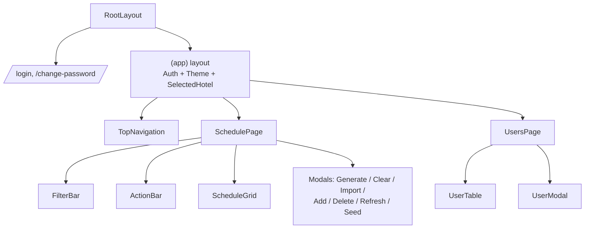
